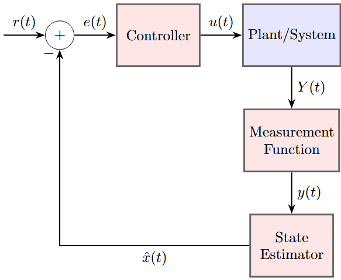

# Trajectory-Tracking-in-Unity-Engine
A project connecting Unity and Python for autonomous system simulations. Unity working as the simulator tool while Python acts as the data processor. **This Github page is a work in progress!!!**

## How this project works: The Unity to Python to Unity Circuit

Blue = Unity ;
Red = Python

### Unity Engine
- Sphere acts as the autonomous system being controlled and uses Unity's rigid body physics.
- Unity will provide ground truth data on the sphere's position (x y z) and velocity (vx vy vz) to Python. This is the signal Y(t).

### Python
- Measurement Function: Takes in ground truth data from Unity Y(t), adds Gaussian noise, outputs y(t)
- State Estimator: Takes in Measuremment Function data y(t), produces optimal state estimation x(t)
- Reference Function: Provides reference coordinates as targets for the autonomous system to reach r(t).
- Controller: Takes in the difference between the reference and optimal estimation r(t) - x(t), outputs control command u(t) that is sent to Unity.

### Unity Engine
- Receives velocity control command from Python u(t) that Unity then executes on the sphere.
- Unity will then provide ground truth data, beginning the circuit again. 
